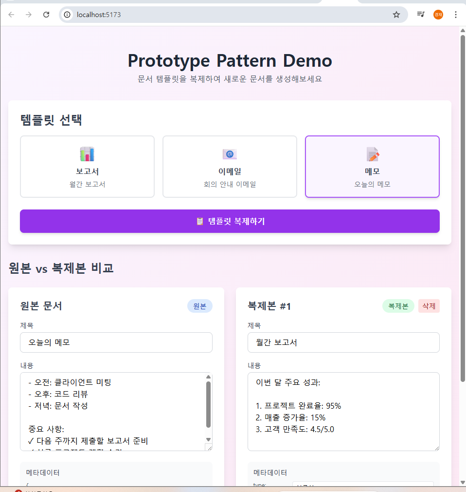
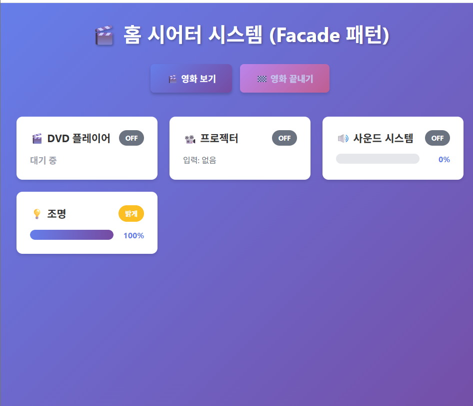
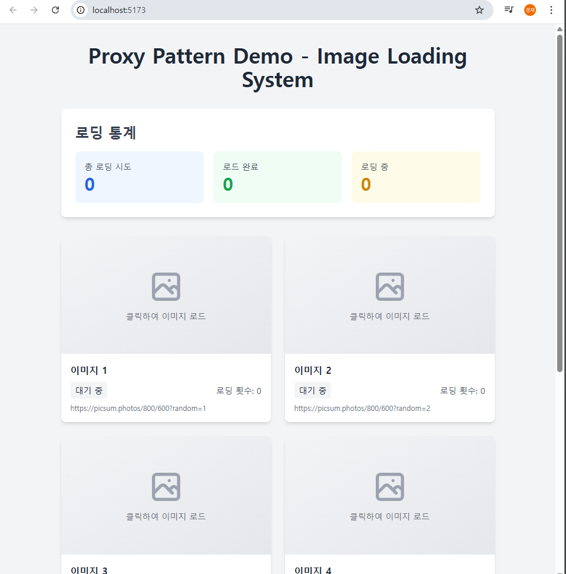
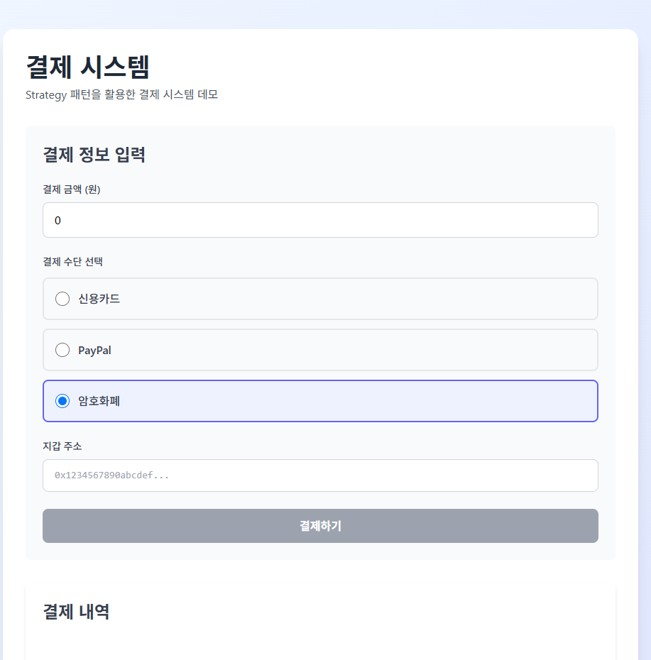
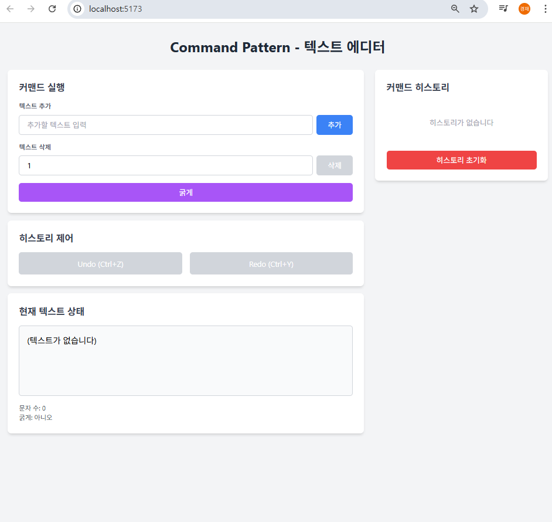

# 디자인 패턴 예제 모음

이 프로젝트는 Vue + TypeScript로 구현된 6개의 디자인 패턴 예제를 포함합니다.

## 기본 예제 실행 및 제출 방법

제공된 6개 디자인 패턴 예제 코드(Vue + TypeScript)를 실행해보고, 실행 결과 화면을 캡처하여 제출하면 될 것 같습니다.

---

## 1. Builder Pattern (빌더 패턴)

**설명:**
Builder 패턴은 복잡한 객체를 단계별로 생성할 수 있도록 도와주는 디자인 패턴입니다. 객체 생성 과정을 세분화하여 가독성을 높이고, 선택적 매개변수를 유연하게 처리할 수 있습니다.

이 예제에서는 사용자 프로필을 단계별로 생성하는 빌더를 구현했습니다. 이름, 나이, 이메일, 전화번호, 주소 등의 정보를 입력받아 프로필 객체를 생성합니다.

**주요 특징:**
- 단계별 객체 생성
- 선택적 필드 지원
- 메서드 체이닝을 통한 유연한 구성


---

## 2. Command Pattern (커맨드 패턴)

**설명:**
Command 패턴은 요청을 객체로 캡슐화하여 매개변수화, 요청의 큐잉, 로깅, 그리고 실행 취소(undo)를 지원하는 디자인 패턴입니다.

이 예제에서는 텍스트 에디터에 Write, Delete, Bold 등의 명령을 구현하고, Undo/Redo 기능을 제공합니다. 각 명령은 객체로 캡슐화되어 히스토리 관리가 가능합니다.

**주요 특징:**
- 요청의 객체화
- Undo/Redo 기능
- 명령 히스토리 관리
- 키보드 단축키 지원 (Ctrl+Z, Ctrl+Y)



---

## 3. Facade Pattern (퍼사드 패턴)

**설명:**
Facade 패턴은 복잡한 서브시스템에 대한 단순화된 인터페이스를 제공하는 디자인 패턴입니다. 여러 클래스의 복잡한 상호작용을 하나의 간단한 인터페이스로 통합합니다.

이 예제에서는 홈 시어터 시스템을 구현했습니다. DVD 플레이어, 프로젝터, 사운드 시스템, 조명 등 여러 서브시스템을 하나의 Facade를 통해 제어할 수 있습니다.

**주요 특징:**
- 복잡한 서브시스템의 단순화
- 단일 진입점 제공
- 시스템 간 결합도 감소



---

## 4. Prototype Pattern (프로토타입 패턴)

**설명:**
Prototype 패턴은 기존 객체를 복제하여 새로운 객체를 생성하는 디자인 패턴입니다. 객체 생성 비용이 높거나 동일한 구조의 객체를 여러 개 생성해야 할 때 유용합니다.

이 예제에서는 문서 템플릿을 복제하여 새로운 문서를 생성하는 시스템을 구현했습니다. 원본 템플릿을 기반으로 복제본을 만들고, 각 복제본을 독립적으로 수정할 수 있습니다.

**주요 특징:**
- 객체 복제를 통한 생성
- 깊은 복사(Deep Copy) 지원
- 템플릿 기반 객체 생성
- 원본과 복제본의 독립성



---

## 5. Proxy Pattern (프록시 패턴)

**설명:**
Proxy 패턴은 다른 객체에 대한 접근을 제어하는 대리자 또는 플레이스홀더를 제공하는 디자인 패턴입니다. 실제 객체에 대한 접근 전후에 추가 작업을 수행할 수 있습니다.

이 예제에서는 이미지 로딩을 지연시키는 가상 프록시(Virtual Proxy)를 구현했습니다. 이미지는 클릭할 때까지 로드되지 않으며, 한 번 로드된 이미지는 캐시되어 재사용됩니다.

**주요 특징:**
- 지연 로딩(Lazy Loading)
- 캐싱 기능
- 실제 객체 접근 제어
- 리소스 최적화



---

## 6. Strategy Pattern (전략 패턴)

**설명:**
Strategy 패턴은 알고리즘을 정의하고 각각을 캡슐화하여 상호 교환 가능하게 만드는 디자인 패턴입니다. 클라이언트는 독립적으로 알고리즘을 선택하여 사용할 수 있습니다.

이 예제에서는 결제 시스템을 구현했습니다. 신용카드, PayPal, 암호화폐 등 다양한 결제 수단을 전략으로 구현하여 런타임에 선택할 수 있습니다.

**주요 특징:**
- 알고리즘의 캡슐화
- 런타임 전략 선택
- 전략 간 교환 가능
- 확장성과 유지보수성 향상



---

## 실행 방법

각 패턴 예제는 독립적인 Vue 프로젝트로 구성되어 있습니다. 각 디렉토리에서 다음 명령어를 실행하여 개발 서버를 시작할 수 있습니다:

```bash
npm install
npm run dev
```

또는 빌드된 버전을 실행하려면:

```bash
npm run build
npm run preview
```

---

## 패턴별 디렉토리 구조

- `build/` - Builder Pattern 및 Prototype Pattern
- `command/` - Command Pattern
- `facade/` - Facade Pattern
- `proxy/` - Proxy Pattern
- `strategy/` - Strategy Pattern

각 디렉토리는 독립적인 Vue 프로젝트로 구성되어 있으며, `src/patterns/` 디렉토리 내에 해당 패턴의 구현 코드가 포함되어 있습니다.

